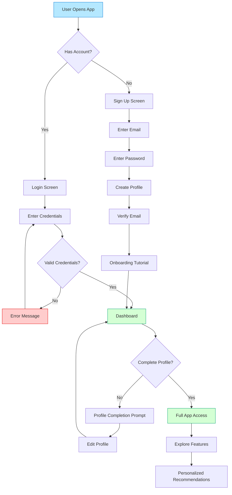
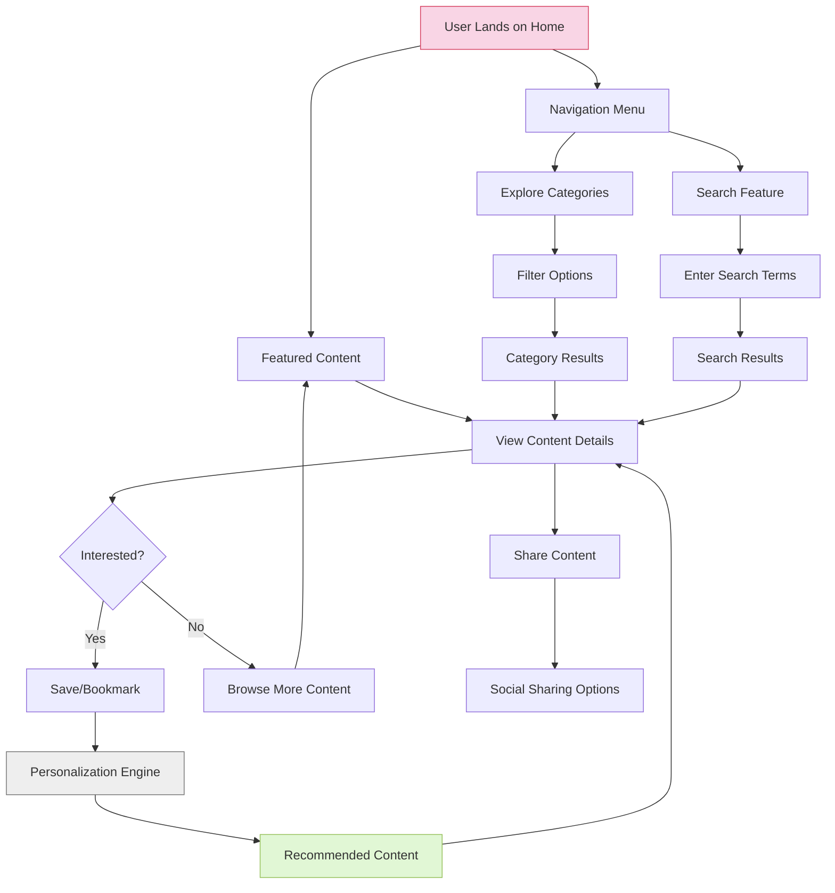
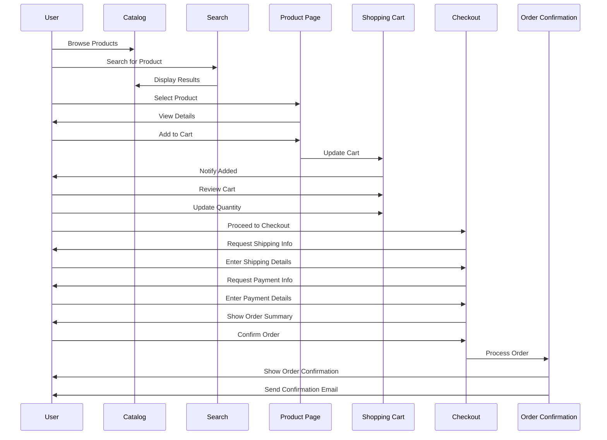

# Sample User Flow Diagram

Below is a sample user flow diagram illustrating the process of user registration and onboarding for a mobile application.

## Alternative User Flow: Feature Discovery

Below is an alternative user flow focusing on feature discovery and engagement.

## E-Commerce Purchase Flow

Here's a sample e-commerce user purchase flow.

These diagrams can be visualized using any Mermaid-compatible viewer, including many GitHub repositories, Notion, VSCode with Mermaid extensions, or online editors like [Mermaid Live Editor](https://mermaid.live/).